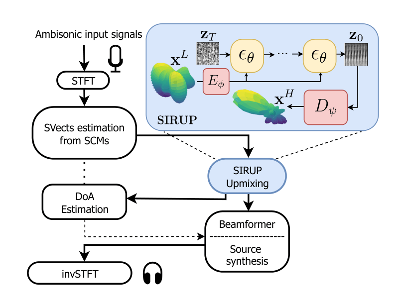

# SIRUP: Diffusion-Based Virtual Upmixing of First-Order Ambisonics

Repository for the ICASSP 2026 paper:
**"SIRUP: A diffusion-based virtual upmixer of steering vectors for highly-directive spatialization with first-order ambisonics"**

**Authors:** Emilio Picard, Diego Di Carlo, Aditya Arie Nugraha, Mathieu Fontaine, Kazuyoshi Yoshii

## Overview

This project implements a VAE + diffusion pipeline for virtual upmixing of first-order ambisonics (FOA) steering vectors into higher-order ambisonics (HOA) representations. It provides model definitions, training scripts, and dataset tooling.



## Installation

```bash
python -m pip install -r requirements.txt
```

Optional editable install:

```bash
python -m pip install -e .
```

## Training

### Train VAE

```bash
python train/train_vae.py --config ckpts/config.yaml
```

### Train DDPM

```bash
python train/train_ddpm.py --config ckpts/config.yaml
```

## Dataset

Training scripts expect a directory structure of per-room `.pkl` files, e.g.:

```
data/
	room_000/
		room_sim_0000.pkl
		room_sim_0001.pkl
	room_001/
		room_sim_0000.pkl
```

Each `.pkl` must contain `svect_foa` and `svect_hoa` arrays.

## Data availability

The paper dataset is not bundled with this repository. Provide the path to your local dataset via `ckpts/config.yaml` under `dataset_params.im_path`.

## Reproducibility

- Use the same `ckpts/config.yaml` for training and evaluation.
- Set seeds in the training scripts if you need deterministic runs.
- GPU is recommended for training; CPU runs are intended only for smoke tests.

## Project structure

```
models/         # Core model definitions
datasets/       # Data loaders and dataset utilities
train/          # Training scripts and schedulers
preprocessing/  # Dataset generation utilities
scripts/        # Utility scripts (smoke tests, etc.)
tests/          # Test suite mirroring repo structure
```

## Smoke Test

```bash
python scripts/smoke_test.py --config ckpts/config.yaml
```

## Tests

```bash
pytest -q
```

## Citation

If you use this code, please cite the ICASSP 2026 paper.

```bibtex
@inproceedings{picard2026sirup,
	title={SIRUP: A diffusion-based virtual upmixer of steering vectors for highly-directive spatialization with first-order ambisonics},
	author={Picard, Emilio and Di Carlo, Diego and Nugraha, Aditya Arie and Fontaine, Mathieu and Yoshii, Kazuyoshi},
	booktitle={Proceedings of IEEE ICASSP},
	year={2026}
}
```

## Contact

For questions or issues, please contact:
- email: [emilio.picard@free.fr](mailto:emilio.picard@free.fr)


## Licence

MIT License

Copyright (c) 2026 Emilio Picard

Permission is hereby granted, free of charge, to any person obtaining a copy of this software and associated documentation files (the "Software"), to deal in the Software without restriction, including without limitation the rights to use, copy, modify, merge, publish, distribute, sublicense, and/or sell copies of the Software, and to permit persons to whom the Software is furnished to do so, subject to the following conditions:

The above copyright notice and this permission notice shall be included in all copies or substantial portions of the Software.

THE SOFTWARE IS PROVIDED "AS IS", WITHOUT WARRANTY OF ANY KIND, EXPRESS OR IMPLIED, INCLUDING BUT NOT LIMITED TO THE WARRANTIES OF MERCHANTABILITY, FITNESS FOR A PARTICULAR PURPOSE AND NONINFRINGEMENT. IN NO EVENT SHALL THE AUTHORS OR COPYRIGHT HOLDERS BE LIABLE FOR ANY CLAIM, DAMAGES OR OTHER LIABILITY, WHETHER IN AN ACTION OF CONTRACT, TORT OR OTHERWISE, ARISING FROM, OUT OF OR IN CONNECTION WITH THE SOFTWARE OR THE USE OR OTHER DEALINGS IN THE SOFTWARE.
